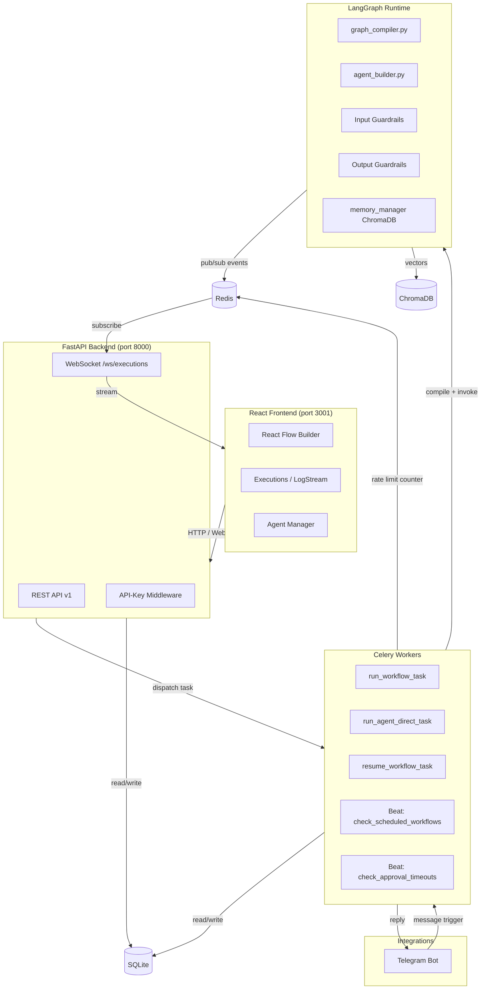

# AgentFlow — AI Agent Orchestration Platform

A production-ready platform for creating AI agents, configuring collaborative workflows, and monitoring real-time execution — with Telegram integration and a visual drag-and-drop workflow builder.

---

## Table of Contents

- [Architecture](#architecture)
- [Why LangGraph?](#why-langgraph)
- [Tech Stack](#tech-stack)
- [Quick Start](#quick-start)
- [Features](#features)
- [Demo Walkthrough](#demo-walkthrough)
- [Project Structure](#project-structure)
- [API Reference](#api-reference)

---

## Architecture



### Execution Flow

1. User triggers workflow via UI **or** Telegram message
2. FastAPI creates an `Execution` record → dispatches Celery task
3. Celery worker loads workflow from DB, compiles LangGraph `StateGraph`
4. Graph executes agents sequentially/conditionally, each node:
   - **Input guardrails**: checks keywords + length before calling LLM
   - Retrieves memory from ChromaDB
   - Calls LLM (with optional JSON response_format for router agents)
   - Executes tools (web_search, calculator, custom webhooks, etc.)
   - **Output guardrails**: blocks forbidden keywords in response
   - Emits log events to Redis pub/sub
   - Stores output to ChromaDB memory
5. FastAPI WebSocket subscribes to Redis → streams logs to browser in real-time
6. On completion: Telegram bot replies to the originating chat

### Execution Flow

1. User triggers workflow via UI **or** Telegram message
2. FastAPI creates an `Execution` record → dispatches Celery task
3. Celery worker loads workflow from DB, compiles LangGraph `StateGraph`
4. Graph executes agents sequentially/conditionally, each node:
   - Retrieves memory from ChromaDB
   - Calls LLM with tools (web_search, calculator, etc.)
   - Emits log events to Redis pub/sub
   - Stores output to ChromaDB memory
5. FastAPI WebSocket subscribes to Redis → streams logs to browser in real-time
6. On completion: Telegram bot replies to the originating chat

---

## Why LangGraph?

LangGraph was chosen over CrewAI, AutoGen, and a custom runtime:

| Criterion | LangGraph ✓ | CrewAI | AutoGen |
|---|---|---|---|
| **Graph topology** | Arbitrary (cycles, fan-out, conditions) | Fixed crew→task | Conversation chains |
| **Visual mapping** | 1:1 with React Flow nodes/edges | Hard to serialize | N/A |
| **Checkpointing** | Built-in SqliteSaver/PostgresSaver | External | External |
| **Streaming** | Native `astream()` | Limited | Limited |
| **State management** | TypedDict, persisted per thread | Per-crew | Per-conversation |

LangGraph's graph model means each visual node in React Flow maps directly to a LangGraph node — zero impedance mismatch between the UI and the runtime.

---

## Tech Stack

| Layer | Technology | Rationale |
|---|---|---|
| Agent Runtime | LangGraph 0.2.x + LangChain 0.3.x | Graph execution, streaming, checkpoints |
| LLM Providers | OpenAI GPT-4o + Anthropic Claude | Per-agent model selection |
| Backend API | FastAPI + Uvicorn (async) | WebSocket-native, auto OpenAPI docs |
| Task Queue | Celery 5.x + Redis | Async execution, retries, scheduling |
| Database | SQLite → PostgreSQL via SQLAlchemy 2.0 | Zero-config local, easy prod upgrade |
| Vector Memory | ChromaDB embedded | No extra service for local dev |
| Real-time | WebSockets + Redis pub/sub | Live log streaming |
| Telegram | python-telegram-bot 21.x (asyncio) | Full async, polling or webhook |
| Frontend | React 18 + TypeScript + Vite | Fast DX, type safety |
| Workflow UI | React Flow 11.x | Purpose-built for node-edge graphs |
| Styling | shadcn/ui + Tailwind CSS | Accessible, composable |
| Containers | Docker + docker-compose v2 | Single command startup |

---

## Quick Start

### Prerequisites

- Docker & Docker Compose v2
- An OpenAI API key (`sk-...`)

### Setup (one command)

```bash
git clone <repo-url>
cd agent-orchestration-platform

# Copy and edit environment config
cp .env.example .env
# Edit .env — add your OPENAI_API_KEY (required)
# Optional: ANTHROPIC_API_KEY, TELEGRAM_BOT_TOKEN

# Build and start everything
make dev
# Or: docker compose up --build
```

After ~2 minutes:
- **UI**: http://localhost:3001
- **API Docs**: http://localhost:8000/docs
- **Health**: http://localhost:8000/api/v1/health

### With Telegram Bot

```bash
# Add to .env:
TELEGRAM_BOT_TOKEN=your-bot-token-here

# Start with Telegram profile
make telegram
# Or: docker compose --profile telegram up
```

### Demo Mode (seeds templates automatically)

```bash
make demo
```

This creates the Research Pipeline and Customer Support Triage workflows and opens the UI.

### Optional: API Key Authentication

Set `API_KEY=your-secret-key` in `.env` to require an `X-API-Key` header on all API requests. Leave it empty (default) to disable authentication for local development.

### Optional: Approval Timeout

Set `APPROVAL_TIMEOUT_MINUTES=60` (default) to automatically fail executions stuck in `awaiting_approval` after that interval. The Celery Beat service checks every 5 minutes.

---

## Features

### Agent Management
- **Full CRUD**: name, role, system prompt, model (GPT-4o, Claude 3.5, etc.), temperature
- **Tools**: web_search (DuckDuckGo), web_scraper, calculator, datetime, send_telegram, custom webhooks
- **Memory**: per-agent ChromaDB vector store, persisted across executions
- **Guardrails**: output keyword blocking + input keyword blocking + max input/output length limits
- **Output format**: `text` (default) or `json` — forces structured JSON output, ideal for router agents
- **Live test**: test any agent inline without running a full workflow

### Visual Workflow Builder
- **React Flow canvas**: drag agents onto the canvas, draw edges between them
- **Conditional routing**: add conditions on edges for intelligent branching
- **Run inline**: trigger workflow execution from the builder, navigate to live logs

### Pre-built Templates

**1. Research + Summarizer Pipeline**
```
[Start] → [Research Agent] → [Summarizer Agent] → [End]
```
- Researcher uses web_search + web_scraper to gather information
- Summarizer synthesizes findings into an executive summary

**2. Customer Support Triage**
```
[Start] → [Triage Agent] ──billing──→ [Billing Specialist] → [End]
                          ──technical→ [Tech Support]       → [End]
                          ──general──→ [General Support]    → [End]
```
- Triage classifies the issue via JSON output
- LangGraph conditional routing sends to the right specialist

### Real-time Monitoring
- **WebSocket log stream**: live events per agent (LLM start/end, tool calls, errors)
- **Color-coded levels**: blue=LLM, yellow=tools, green=completed, red=errors
- **Execution history**: full log of all past runs with final output

### Telegram Integration
- Any message to the bot triggers the configured workflow
- `/start` returns your chat ID for configuration
- Final workflow output is automatically delivered to the chat

---

## Demo Walkthrough

1. **Open** http://localhost:3001

2. **Create template**: Templates → "Use Template" on "Research + Summarizer"

3. **Open workflow**: Workflows → "Research + Summarizer Pipeline"
   - See: Start → Research Agent → Summarizer Agent → End

4. **Run workflow**: Click "Run Workflow" → enter:
   > `What are the top 5 AI breakthroughs of 2024?`

5. **Watch live**: See Research Agent call web_search and web_scraper tools in real-time, then Summarizer Agent produce an executive summary

6. **Telegram**: Message your bot the same question — get the researched reply in ~30-60s

7. **Customer Support**: Use "Customer Support Triage" template → trigger with:
   > `My invoice shows an incorrect charge`
   Watch: Triage → "billing" → Billing Specialist responds

---

## Project Structure

```
agent-orchestration-platform/
├── docker-compose.yml           # All 6 services
├── .env.example                 # All config variables documented
├── Makefile                     # setup / dev / demo / stop
│
├── backend/
│   └── app/
│       ├── main.py              # FastAPI app + lifespan
│       ├── config.py            # Pydantic Settings
│       ├── models/              # ORM: Agent, Workflow, Execution, etc.
│       ├── api/v1/              # REST routers
│       ├── api/ws/monitor.py    # WebSocket log streaming
│       ├── core/
│       │   ├── state.py         # LangGraph AgentFlowState TypedDict
│       │   ├── agent_builder.py # DB Agent → LangGraph callable
│       │   ├── graph_compiler.py# DB Workflow → CompiledStateGraph
│       │   ├── log_emitter.py   # Redis pub/sub events
│       │   └── memory_manager.py# ChromaDB per-agent memory
│       ├── tools/               # web_search, calculator, scraper, telegram
│       ├── workers/             # Celery tasks
│       ├── integrations/telegram/ # Bot + handlers
│       └── templates/           # research_pipeline, customer_support
│
└── frontend/
    └── src/
        ├── api/                 # Axios + TanStack Query hooks
        ├── stores/              # Zustand execution store (WebSocket)
        ├── components/
        │   ├── workflows/       # WorkflowBuilder (React Flow) + AgentNode
        │   └── executions/      # LogStream (WebSocket terminal)
        └── pages/               # Dashboard, Agents, Workflows, Executions
```

---

## API Reference

Base URL: `http://localhost:8000/api/v1`

| Method | Endpoint | Description |
|---|---|---|
| GET | `/health` | System health check |
| GET | `/tools` | List available agent tools |
| GET/POST | `/agents` | List/create agents |
| GET/PATCH/DELETE | `/agents/{id}` | Get/update/delete agent |
| POST | `/agents/{id}/test` | Test agent with a prompt |
| GET/DELETE | `/agents/{id}/memory` | View/clear agent memory |
| GET/POST | `/workflows` | List/create workflows |
| POST | `/workflows/{id}/graph` | Save visual graph (nodes+edges) |
| POST | `/workflows/{id}/trigger` | Start workflow execution |
| GET | `/executions` | List all executions |
| GET | `/executions/{id}/logs` | Paginated execution logs |
| GET | `/templates` | List workflow templates |
| POST | `/templates/{slug}/instantiate` | Create workflow from template |
| WS | `/ws/executions/{id}/logs` | Real-time log streaming |

---

## Running Tests

```bash
# From the backend directory (or inside the backend container)
cd backend
pip install -r requirements.txt
pytest

# With coverage
pytest --tb=short -v
```

Tests cover: agent CRUD, workflow CRUD + graph saving, template instantiation, graph compiler (linear + conditional routing), guardrail keyword blocking, and cost calculator.

---

## How to Add a New Workflow Template

1. Create `backend/app/templates/my_template.py` with an `async def create_my_template(db)` function:

```python
async def create_my_template(db: AsyncSession) -> dict:
    # 1. Create Agent ORM objects and db.add() them
    # 2. Create a Workflow + WorkflowNode + WorkflowEdge objects
    # 3. await db.commit()
    return {"workflow_id": ..., "agents": [...], "message": "Created"}
```

2. Register it in `backend/app/api/v1/templates.py`:

```python
TEMPLATES["my-template"] = {
    "slug": "my-template", "name": "My Template",
    "description": "...", "icon": "zap", "category": "productivity", "agent_count": 2,
}

# In instantiate_template():
elif slug == "my-template":
    from app.templates.my_template import create_my_template
    result = await create_my_template(db)
```

That's it — it appears in the Templates gallery automatically.

---

## How to Add a New Messaging Channel

### Pattern (demonstrated by Telegram)

1. **Create the integration module** at `backend/app/integrations/<channel>/`:
   - `bot.py` — connection/polling loop (runs as its own process)
   - `handlers.py` — receives incoming messages, calls `create_execution()` + dispatches Celery task
   - `router.py` — maps channel user/chat IDs → workflow IDs

2. **Add a docker-compose service**:
```yaml
my_channel_bot:
  build: ./backend
  command: python -m app.integrations.my_channel.bot
  environment: *backend-env
  profiles: ["my-channel"]
```

3. **Add an agent tool** `backend/app/tools/send_my_channel.py` so agents can reply mid-flow.

4. **Register the tool** in `backend/app/core/tool_registry.py`.

5. **Add the trigger type** (`my-channel`) to the workflow settings dropdown in `WorkflowsPage.tsx`.

### Example: Slack
- Use `slack_bolt` library with Socket Mode (no public URL needed for local dev)
- `handlers.py` listens for `message` events, extracts `channel` + `text`, routes via `router.py`
- Reply via `app.client.chat_postMessage(channel=..., text=output)`

---

## Tradeoffs

**SQLite → PostgreSQL**: Change `DATABASE_URL` in `.env` — SQLAlchemy abstracts it completely.

**Celery + asyncio**: Each Celery task opens a new event loop. This adds ~10ms overhead but gives retry logic, dead-letter queues, and scheduled execution (Celery Beat) for free. The alternative (FastAPI BackgroundTasks) cannot be monitored, retried, or scheduled.

**ChromaDB embedded**: No separate service. Swap to Qdrant/Pinecone in production by replacing `memory_manager.py` — it's the only consumer.

**Telegram as separate process**: Avoids signal handler conflicts with Uvicorn. Both share the same DB and Redis via Celery tasks.
